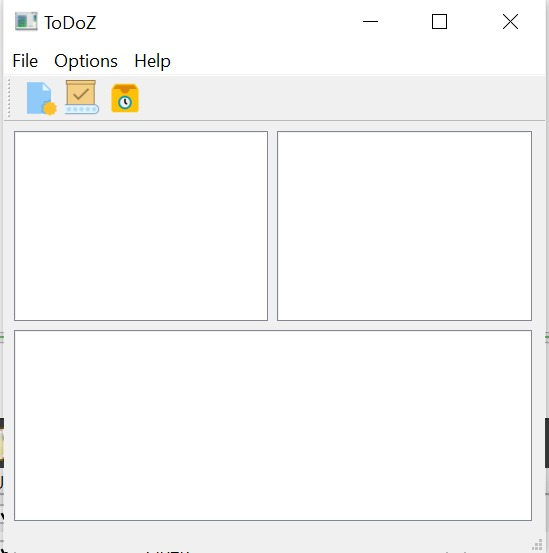

# ToDo Application 
<br>


> **Introduction**
<br>

***Model–view–controller(MVC)***  is a software design pattern commonly used for developing user interfaces that divide the related program logic into three interconnected elements. This is done to separate internal representations of information from the ways information is presented to and accepted from the user.

MVC consists of three kinds of objects:

**<span style="color:red">Model  </span>**: contains application data and business logic (the rules of the system). For example, user accounts, products you sell, a set of photos, etc. The model component has no knowledge of the interface. 

**<span style="color:red">View  </span>**:  contains everything that is visible on the screen and offers interaction to the user.

**<span style="color:red">Controller  </span>**: This is the "glue" between the view and the model, which also manages the application logic. The controller reacts to the user's input and presents the data requested by the user. Where does it retrieve the data from? Yes, you guessed it: the model. 

<br>
<p align="center">
  
</p>


<br>

---
 In this practical course, the goal is to create an **application  using (Item/Model) based containers** to manage your tasks. It should have all the features of main application such as menues, actions and toolbar. The application must store an archive of all the pending and finished tasks.

Here is an overveiw of the application:

<p align="center">
  
</p>
 <br>

 # Let's start !


 With Qt Designer  we will create the interface of our application . First we will start with creating three areas each one has a task:

  * the first one, shows the list of today tasks.

  * The second one is reserved for pending task .

  * the third one shows the set of finished tasks.

  Then, we create the menus (File/Option/Help):


<p float="left">
  
   
  
</p>

Now, our application look like that !

<br>


<p align="center">
  
</p>

<br>

Now let's have some fun in coding.

In the header file of ToDoZ we will declare functions :
 > the header file (ToDoZ.h)

 ```java script

 class ToDoZ : public QMainWindow
{
    Q_OBJECT

public:
    ToDoZ(QWidget *parent = nullptr);
    ~ToDoZ();
    
private slots:

     void on_actionAdd_task_triggered(); // adding a new task
     void on_actionPending_task_triggered(); //pending task
     void on_actionFinished_task_triggered();// finished task
    void on_actionClose_triggered();
    void on_hide_clicked();
      void Hide();
     
    public:

    void makeConnexions();
    void SaveTasks(QString myFile);
  ```

  Now we will implement this methods.

  >The implementation file (ToDoZ.cpp
  ) 
  * First area : New tasks 

  ```java script
  void ToDoZ::on_actionAdd_task_triggered()
{
    auto D =new Tasks() ;
   D->show();

    QString newTask ;
    // Get the line edit text
    QString description = D->getDescription();
    if (description!=NULL){
        //Get Finished bool
        QString finished = D->getFinished();
    // Get current date
         QDate curDate = D->getDueDate();
        newTask = description +"\t Due:"+ curDate.toString() ;
        QString Tag= D->getTag();
        if(Tag == "Work")
            Tag="0";
        else if (Tag == "Life")
            Tag="1";
        else
            Tag="2";
         if (finished=="finished" || curDate < QDate::currentDate())
         {
             newTask = "Finished\t"+newTask+"\tTag :"+Tag+"\n";
              ui->listWidget_3->addItem(newTask);
}
         else if (curDate == QDate::currentDate()){
              newTask = "For Today\t"+newTask+"\tTag :"+Tag+"\n";
                ui->listWidget->addItem(newTask);
         }
         else{
                 newTask = "Pending\t"+newTask+"\tTag :"+Tag+"\n";
                ui->listWidget_2->addItem(new QListWidgetItem(QIcon(":/new/prefix1/icons8-add-property-96.png"),newTask));

         }
    }
    QString fichier = "myFile.txt";

    QFile file(fichier);

    if (file.open(QIODevice::Append | QIODevice::Text)) {
    // whrite in the file
    QTextStream out(&file);
    out << newTask;

    // close the file 
    file.close();
    }
}
```

* Second area: Pending tasks

```java script

void ToDoZ::on_actionPending_task_triggered()
{
    QString widget = ui->listWidget_3->currentItem()->text();

    ui->listWidget_2->addItem(widget);
    QListWidgetItem *remWidget = ui->listWidget_3->currentItem();
    delete remWidget;
}
```

* Third area: Finished tasks

```java script
void ToDoZ::on_actionFinished_task_triggered()
{

    QString widget = ui->listWidget_2->currentItem()->text();

    ui->listWidget_3->addItem(widget);
    QListWidgetItem *remWidget = ui->listWidget_2->currentItem();
    delete remWidget;
}
```
To get description of each task created, we have to add a new class **"Tasks"** where we will describe and enter informations about the task .

>The header file (Tasks.h)
```java script
class Tasks : public QDialog
{
    Q_OBJECT

public:
    explicit Tasks(QWidget *parent = nullptr);
    ~Tasks();
     void showEvent(QShowEvent * event);
    QString GetDescription();
    QString GetTag();
    QString GetFinished();
    QDate GetDueDate();
private:
    Ui::Tasks *ui;
};
```
>The implementation file (Tasks.cpp)
```java script
void Tasks::showEvent(QShowEvent * event)
{
    QDate date = QDate::currentDate();
    ui->dateEdit->setDate(date); 

    QDialog::showEvent(event);
}
QString Tasks::GetDescription(){
    return ui->lineEdit->text();

}
QString Tasks::GetTag(){

    return ui->comboBox->currentText();

}
QString Tasks::GetFinished(){
    if (ui->checkBox->isChecked())
       return "finished";
    else
        return "pending";
}
QDate Tasks::GetDueDate(){

    return ui->dateEdit->date();

}
```
With Qt Designer we show the final look of the Description Dialog .

<p align="center">
  
</p>


To make Connections between slots:
>The implementation file (ToDoZ.cpp
  ) 

```java script
void ToDoZ::makeConnexions(){

    connect(ui->actionAdd_task,&QAction::triggered,this,&ToDoZ::on_actionAdd_task_triggered);
    connect(ui->actionClose,&QAction::triggered,this,&ToDoZ::close);
    connect(ui->actionFinished_task,&QAction::triggered,this,&ToDoZ::on_actionFinished_task_triggered);
    connect(ui->actionHide_finished_task, &QAction::triggered,this , &ToDoZ::hideFinished);
    connect(ui->actionPending_task, &QAction::triggered,this , &ToDoZ::on_actionPending_task_triggered);
    connect(ui->hide, &QPushButton::clicked,this , &ToDoZ::on_hide_clicked);
}
```
Now , we will implement the method which allows us to **Save** tasks.
>The implementation file (ToDoZ.cpp
  ) 

```java script
void ToDoZ::SaveTasks(QString myFile){
    QFile fichier(myFile);

    if(fichier.open(QIODevice::ReadOnly | QIODevice::Text)) 
    {
        QTextStream flux(&fichier);
        while(!flux.atEnd())
        {
            QString temp = flux.readLine();
            if(  temp.startsWith("Finished"))
            ui->listWidget_3->addItem(temp);
            else if( temp.startsWith("Pending"))
                    ui->listWidget_2->addItem(temp);
            else
                ui->listWidget->addItem(temp);
        }
        fichier.close();
    }
  
  ```
To close the application :
>The implementation file (ToDoZ.cpp
  ) 
```java script
void ToDoZ::on_actionClose_triggered()
{
        qApp->quit();
}
```

Our application look like that !
<p align="center">
  
</p>


  To hide the Finished Tasks, we add new PushButton(hide) and here is it's code:
  >The implementation file (ToDoZ.cpp
  ) 

```java script
}
void ToDoZ::Hide(){
   on_hide_clicked();
}
void ToDoZ::on_hide_clicked()
{
  if (listWidget_2.isClicked()
    ui->listWidget_2->setVisible(false);)
  else if(listWidget_3.isClicked())
   ui->listWidget_3->setVisible(false);)
}

```
This is how looks our application when we hide one view 
.

<p align="center">
  
</p>


<br>

---
# MVC 

For the mvc version we will change in the first project, the Tasks class is the same ,but the ToDoZ class will know some changes.

In the header file we will add :

>The header File (ToDoZmvc.h)
```java script
private:

    Ui::ToDoZmvc *ui;

    QStringList Newlist;
    QStringList Pendinglist;
    QStringList Finishedlist;
    QStringListModel * model1 = new QStringListModel () ;//first list view
    QStringListModel* model2= new QStringListModel () ;//second view
    QStringListModel *model3 = new QStringListModel () ;//third view
```

> The implementation File (ToDoZmvc.cpp)

```java script
void ToDoZmvc::on_actionAdd_Task_triggered()
{
    Tasks T ;
    T.setModal(false);
    T.exec();
    QString NewTask ;
    QString description = D.getDescription();
    if (description!=NULL){
        QString finished = D.getFinished();
         QDate curDate = D.getDueDate();
        NewTask = description +"\t Due:"+ curDate.toString() ;
        QString Tag= D.getTag();
        if(Tag == "Work")
            Tag="0";
        else if (Tag == "Life")
            Tag="1";
        else
            Tag="2";
         if (finished=="finished" || curDate < QDate::currentDate())
         {
             Finishedlist.append(description);
             model1->setStringList(Finishedlist);
             ui->Finished->setModel(model1);
         }
         else if ( curDate == QDate::currentDate() ){
              Newlist.append(description);
              model2->setStringList(Newlist);
              ui->NewTask->setModel(model2);
         }
         if (curDate > QDate::currentDate()){
                Pendinglist.append(description);
                model3->setStringList(Pendinglist);
                ui->PendingTask->setModel(model3);

         }
    }
```

```java script
}

void ToDoZmvc::SaveTasks(QString myFile){
    QFile fichier(myFile);
QFile file(myFile);
    if(file.open(QIODevice::ReadWrite | QIODevice::Text)){
        QTextStream out(&file); for(int i=0;i<Newlist.size();i++)
        { out << "1"<< Newlist.at(i)<< Qt::endl; }
        for(int i=0;i<Pendinglist.size();i++)
        { out << "2"<< Pendinglist.at(i) << Qt::endl; }
        for(int i=0;i<Finishedlist.size();i++)
        { out << "3"<< Finishedlist.at(i) << Qt::endl;
        } file.close(); } }
```
* Final Look !
<p align="center">
  
</p>

 <br>

 ---
 # Inhancements

 In this part we will add two functionality **Drag** and **Drop**  .

 For that we will visit an interesting class: **QAbstractItemView** .

 This class is the base class for every standard view that uses a **QAbstractItemModel**. It provides a standard interface for interoperating with models through the signals and slots mechanism, enabling subclasses to be kept up-to-date with changes to their models. This class provides standard support for keyboard and mouse navigation, viewport scrolling, item editing, and selections.

 Now to practice this class, we will add this code for each view in the implementation file of our project.


 >The implementation File (ToDoZmvc.cpp)

 ```java script
 ui->listView->setSelectionMode(QAbstractItemView::ExtendedSelection);
     ui->listView->dragDropOverwriteMode();
     ui->listView->setDragEnabled(true);
     ui->listView->setAcceptDrops(true);
     ui->listView->setDropIndicatorShown(true);
     ui->listView->setDefaultDropAction(Qt::MoveAction);
```
**NB**: same code for each view .

<br>


---
 # Let's Recap!
 * MVC architecture is easy to use and integrate, so it works well for applications. 
 * The Activity is the controller—it links up the view (the layout elements) and the business logic (the model).
 * In MVC, the model can be reused in other Activities to avoid code duplication.
 * A model allows you to store data and reuse it later on.
 <br>

 I hope you find this practical course interesting, see you next time 😄  . 
 <br>

 <br>

<br>


 <h1 align="center">Thank You ! </h1>


